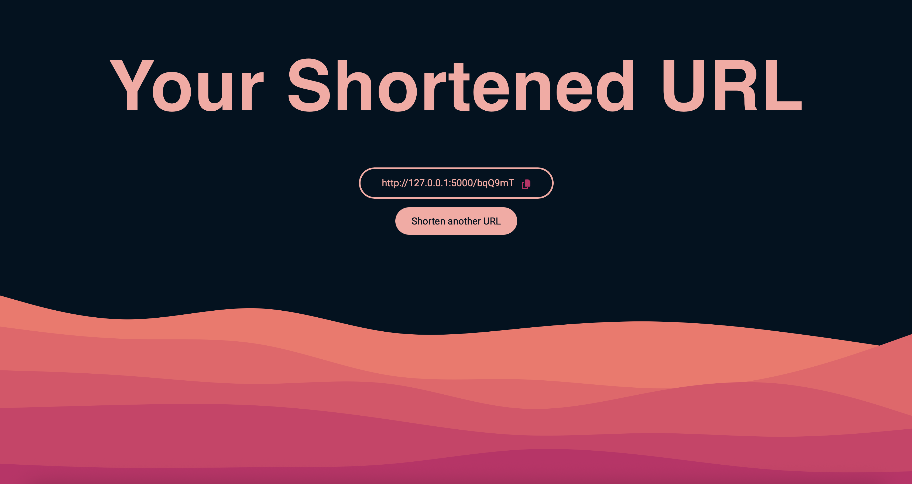

# URL Shortener

A simple URL shortening web application built with Flask, Jinja2, SQLite, Python, HTML, CSS, and JavaScript

## Authors

- [@PedrowDias](https://github.com/PedrowDias)

## Tech Stack

**Frontend:** HTML, CSS, JavaScript, Jinja2  
**Backend:** Python, Flask  
**Database:** SQLite
## Features

- Generate unique short IDs for any given URL
- Redirect short URLs to their original long URLs using local storage and access
- Prevent duplicate short IDs
- URL validation to check proper formatting
- Error handling with console logging and user printing


## Run Locally

Clone the project

```bash
  git clone https://github.com/PedrowDias/url-shortener.git
```

Go to the project directory

```bash
  cd url-shortener
```

Install dependencies

```bash
  pip install -r requirements.txt 
```

Initialize the database and the app

```bash
  python app.py
```

Open your browser and go to http://127.0.0.1:5000/ to access the application.

## Screenshots

### Homepage


### After Shortening

